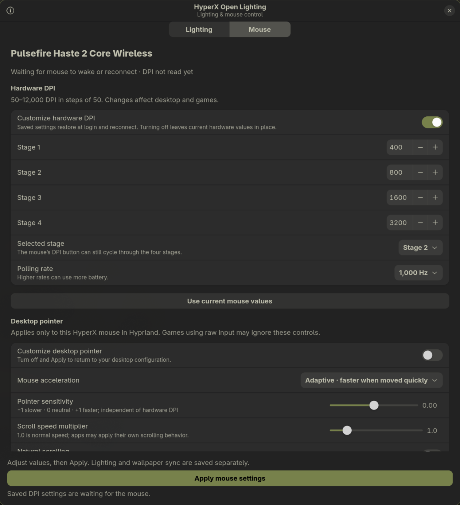
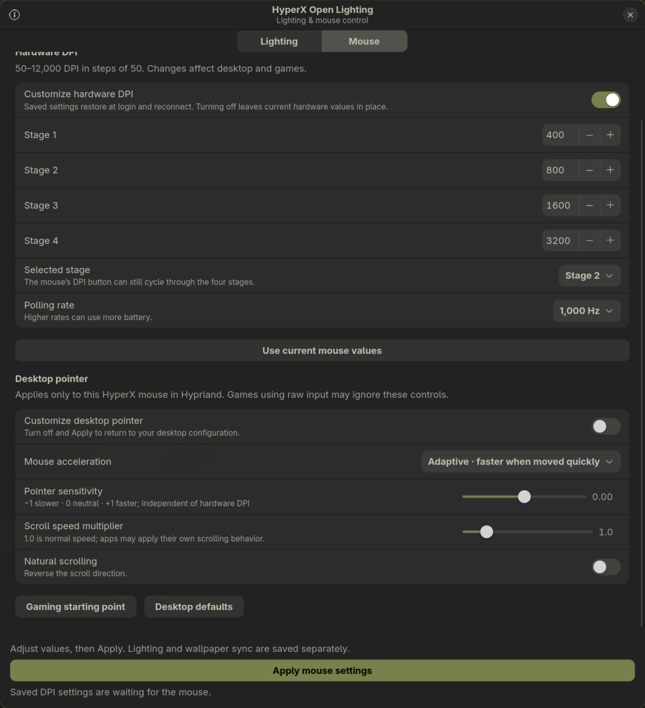

<p align="center"></p>
<h1 align="center">HyperX Open Lighting</h1>
<p align="center">Native Linux lighting and mouse controls for selected HyperX devices.</p>

<p align="center"><a href="https://github.com/abhinavpathak9873/hyperx_open_lighting/releases">Download</a> · <a href="docs/PROTOCOL.md">Protocol notes</a> · <a href="CONTRIBUTING.md">Contribute</a></p>

Control selected HyperX devices directly from Linux with a native GTK interface.
Lighting has been tested on the models below; support for other HyperX
models is not implied. Ctrl/Shift operation was confirmed working after a
keyboard reconnect during setup.


## What it does

- Pick a color and brightness independently for each device.
- Choose static, breathing, color cycle, rainbow wave or off.
- Save locally and keep lighting running after closing the window.
- Start automatically at desktop login and retry sleeping/disconnected devices.
- Control only the devices' native control interfaces; no root background process.
- Edit four hardware DPI stages (50–12,000), select the active stage and polling rate.
- Adjust per-mouse sensitivity, acceleration, scroll speed and direction on Hyprland.

| Device | USB ID | Current status |
| --- | --- | --- |
| HyperX QuadCast 2 S | `03f0:02b5` (RGB controller) | 108 LEDs through OpenRGB; manual color/brightness SDK readback tested |
| HyperX Alloy Rise 75, wired | `03f0:02a1` | RGB, brightness and physical modifier operation tested |
| HyperX Pulsefire Haste 2 Core Wireless, USB receiver | `03f0:0ab5` | RGB, brightness and DPI readback tested; polling controls included |

Other models and Bluetooth connections are not supported. The mouse has one RGB
zone, so its rainbow wave appears as a color cycle. Software effects need the
background service and may increase wireless battery consumption. Settings are
saved on the computer; the app does not write onboard flash profiles.

## QuadCast 2 S and OpenRGB

The microphone uses OpenRGB's native **HyperX QuadCast 2 S** driver. OpenRGB is
its only USB owner and maintains the hardware lighting session; this app never
opens a second microphone HID connection. Microphone audio, gain and mute
controls are not modified.

1. Install an OpenRGB build whose supported devices include **HyperX QuadCast 2 S**,
   with its USB permissions installed. Older builds without this driver will not work.
2. Enable the OpenRGB SDK server on **127.0.0.1:6742**. For example,
   `openrgb --server --server-host 127.0.0.1 --startminimized`.
3. Check that the microphone appears with **108 LEDs** in OpenRGB. If you plugged
   it in after OpenRGB started, rescan or restart OpenRGB.
4. Open HyperX Open Lighting. The microphone defaults to **Follow OpenRGB**.
   Its colors, effects and saved profiles then come directly from OpenRGB.
   Include it in your usual OpenRGB startup profile and wallpaper sync.

Choose a manual effect on the microphone card and **Apply & save** to control it
from this app. Brightness scales the RGB output. Animated effects stream through
the SDK; static/off are applied once per saved change or SDK reconnect. In manual
animated mode this app controls the colors; choose **Follow OpenRGB** before
using OpenRGB effects/profiles. Follow mode stops app writes; it does not reload
an earlier OpenRGB profile automatically. Disabling microphone control also
leaves OpenRGB in charge and does not turn off the microphone or its lights.

```sh
hyperx-open-lighting --device microphone --mode Static --color 78824b
hyperx-open-lighting --device microphone --mode 'Follow OpenRGB'
```

`--device both` retains its keyboard-and-mouse meaning; `--device all` includes
the microphone. Disconnected devices wait independently without blocking the
microphone. Existing keyboard, mouse and DPI preferences survive upgrades.
OpenRGB must also start at login for microphone control; if its SDK server
restarts, this app reconnects automatically.

## Install

Requires a Linux desktop with **systemd**, **Python 3.10+**, **GTK 4.10+**,
**PyGObject** and **libadwaita**. Tested locally on Arch/Omarchy; package smoke tests
also run in Ubuntu 24.04. Other distributions are best effort.

### Debian / Ubuntu 24.04 or newer

Download the `.deb` from [Releases](https://github.com/abhinavpathak9873/hyperx_open_lighting/releases), then:

```sh
sudo apt install ./hyperx-open-lighting_0.3.0_all.deb
```

Open **HyperX Open Lighting** from your application launcher. Opening it enables
the user service for future logins. No reboot is required. If access is denied,
unplug/replug the keyboard and receiver after installing the package.

### Arch / Omarchy, Fedora, or install from source

Install the system dependencies first:

```sh
# Arch / Omarchy
sudo pacman -S --needed python python-gobject gtk4 libadwaita

# Fedora
sudo dnf install python3 python3-gobject gtk4 libadwaita

# Debian / Ubuntu 24.04+ (for the source installer)
sudo apt install python3 python3-gi gir1.2-gtk-4.0 gir1.2-adw-1
```

Download and extract the `.tar.gz` release, or clone the repository:

```sh
git clone https://github.com/abhinavpathak9873/hyperx_open_lighting.git
cd hyperx_open_lighting
/usr/bin/python3 install.py
```

Use your **normal desktop user**, not `sudo python install.py`. The installer
requests administrator authentication only for the two USB access rules. It
installs the app under `~/.local/share/hyperx-rgb`, adds a launcher and icon, and
enables its user service. On Omarchy the same dependencies can also be installed
with `omarchy pkg add python python-gobject gtk4 libadwaita`.

Releases provide a native installer and a `.deb`, **not an AppImage**.
GTK, USB access and login integration are explicit system dependencies; the
archive is not advertised as a self-contained executable.

## Use

1. Open **HyperX Open Lighting**.
2. Enable the device you want to control.
3. Choose a color, effect and brightness, then click **Apply & save**.
4. Close the window. The service continues in the background.

**Pause all lighting now** stops both streams immediately and preserves colors.
The device's existing onboard lighting returns after its host-control timeout.
“Off” streams black; “Paused” releases software control. Startup is at desktop
login, not at the boot/lock screen before a user has device permissions.

```sh
hyperx-open-lighting --status
hyperx-open-lighting --doctor
hyperx-open-lighting --device mouse --color ff5268 --brightness 70 --mode Static
hyperx-open-lighting --device mouse --enable
hyperx-open-lighting --device both --disable
# Enable keyboard lighting:
hyperx-open-lighting --device keyboard --enable
```

The user installer also provides the `hyperx-rgb` command for compatibility.

### Mouse controls

Open the **Mouse** tab. It displays the mouse's current hardware DPI and polling
rate after connecting; DPI-stage changes are tracked from mouse notifications. Enable **Customize hardware DPI**, edit the
four stages, choose the selected stage and click **Apply mouse settings**.
Changing a hardware control enables customization automatically. Supported DPI
is **50–12,000 in steps of 50**; polling rates are **125, 250, 500 and 1,000 Hz**.
The app preserves stage colors and unrelated table bytes, then verifies readback.
The physical DPI button still cycles stages. **Use one DPI for all stages** copies
the selected DPI across all four stages and enables persistent **Keep a single DPI**
mode. Subsequent edits stay synchronized, so the DPI button cannot change
sensitivity. Turn this mode off explicitly to configure different stages.
Wheel scrolling over controls scrolls the page instead of changing settings.
An older window cannot overwrite settings changed by another window or the CLI;
reopen it to load the latest settings before applying.
Apply and login restore your saved selection. Transient wireless retries preserve
the last observed stage; a reset DPI table is restored without an unnecessary
write when it already matches. Disabling customization stops restoring
saved DPI; it leaves the current hardware values in place.

**Gaming starting point** prepares 800 DPI, 1,000 Hz, flat acceleration, neutral
pointer sensitivity and normal scrolling; click Apply to use it. This is a
starting point, not a universally best sensitivity. Fine-tune in-game sensitivity
for your preference. **Desktop defaults** removes the app's pointer overrides
when applied, without changing hardware DPI.

Desktop controls currently require **Hyprland**. Sensitivity ranges from −1 to
+1, acceleration can be flat or adaptive, and wheel speed ranges from 0.1× to 5×.
Natural scrolling reverses the direction. These controls target only the Haste 2
Core mouse; other pointing devices retain their own settings. Games using raw
input may bypass desktop controls, and individual apps can further scale scroll.
Hardware DPI works on other supported systemd desktops; pointer controls are
shown unavailable there.

DPI is saved separately in `~/.config/hyperx-rgb/mouse.json`, so lighting CLI
updates and wallpaper integration cannot erase it. Hyprland pointer settings
use a guarded include from `hyprland.lua` (or `source` in `hyprland.conf`) to
`~/.config/hyperx-rgb/pointer.lua` / `pointer.conf`. The main configuration is
backed up before adding the include; invalid changes are rolled back. Custom
Hyprland config paths need manual integration. The source uninstaller and Debian
removal retain these user settings; apply **Desktop defaults** first if you want
the pointer overrides removed. Changes persist at desktop login, not pre-login.

```sh
hyperx-open-lighting --dpi 800
hyperx-open-lighting --polling-rate 1000
hyperx-open-lighting --status  # includes actual DPI and readback errors
```






## Troubleshoot

- **Ctrl/Shift or other keys misbehave:** pause keyboard lighting, reconnect the
  keyboard if needed, and retry. See [troubleshooting notes](docs/KNOWN_ISSUES.md).
- **Waiting for mouse:** move it to wake it. The keyboard worker is independent.
- **Permission denied:** check `--doctor`; reconnect after installing the udev rule.
- **No service:** run the installer, or reopen the packaged app in a systemd desktop session.
- **GUI missing:** use system Python and install the GTK dependencies above.
- **Original RGB alternates with your color:** direct lighting needs continuous
  frames. The app sends them at 20 FPS, even for static/off settings.

```sh
systemctl --user restart hyperx-rgb.service
journalctl --user -u hyperx-rgb.service -n 30
systemctl --user disable --now hyperx-rgb.service  # stop + disable startup
```

Settings live at `$XDG_CONFIG_HOME/hyperx-rgb/settings.json`, normally
`~/.config/hyperx-rgb/settings.json`. Existing colors are retained during upgrades;
old settings without enable flags keep lighting enabled.
There is no telemetry or key-event logging. Microphone control connects only to the local OpenRGB SDK at `127.0.0.1:6742`.

## Update / uninstall

For a source install, pull a tagged release and rerun `/usr/bin/python3 install.py`.
To uninstall: `/usr/bin/python3 install.py --uninstall`. Settings and the udev rule
are intentionally retained. To remove the rule too:

```sh
sudo rm /etc/udev/rules.d/60-hyperx-rgb.rules
sudo udevadm control --reload-rules
```

For a Debian package: `sudo apt remove hyperx-open-lighting`; first stop/disable
the user service with the command above. Do not mix user and system installs;
uninstall the old installation method before switching.

## Development

```sh
PYTHONPATH=src /usr/bin/python3 -m unittest discover -s tests -v
PYTHONPATH=src /usr/bin/python3 -m hyperx_open_lighting --doctor
/usr/bin/python3 scripts/build_release.py
```

[Protocol notes](docs/PROTOCOL.md) separate observed behavior from assumptions.
[Contributing](CONTRIBUTING.md) describes hardware testing and release builds.

MIT licensed. This is an independent project, not affiliated with or endorsed by
HP or HyperX. The project icon is original artwork, not the HyperX company logo.
