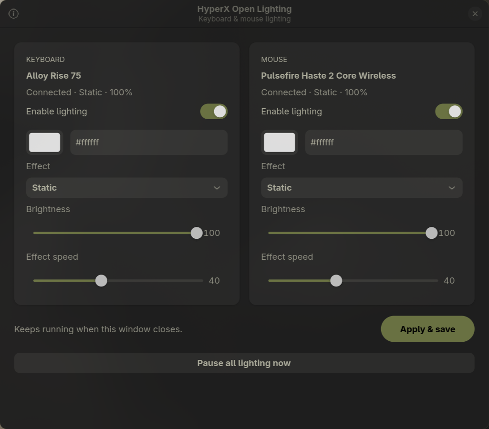

<p align="center"></p>
<h1 align="center">HyperX Open Lighting</h1>
<p align="center">A small Linux app for your keyboard and mouse colors.</p>

<p align="center"><a href="https://github.com/abhinavpathak9873/hyperx_open_lighting/releases">Download</a> · <a href="docs/PROTOCOL.md">Protocol notes</a> · <a href="CONTRIBUTING.md">Contribute</a></p>

Control selected HyperX devices directly from Linux with a native GTK interface.
Lighting has been tested on the two models below; support for other HyperX
models is not implied. Ctrl/Shift operation was confirmed working after a
keyboard reconnect during setup.



## What it does

- Pick a color and brightness independently for each device.
- Choose static, breathing, color cycle, rainbow wave or off.
- Save locally and keep lighting running after closing the window.
- Start automatically at desktop login and retry sleeping/disconnected devices.
- Control only the devices' RGB interfaces; no root background process.

| Device | USB ID | Current status |
| --- | --- | --- |
| HyperX Alloy Rise 75, wired | `03f0:02a1` | RGB, brightness and physical modifier operation tested |
| HyperX Pulsefire Haste 2 Core Wireless, USB receiver | `03f0:0ab5` | Lighting/brightness commands tested; limited field testing |

Other models and Bluetooth connections are not supported. The mouse has one RGB
zone, so its rainbow wave appears as a color cycle. Software effects need the
background service and may increase wireless battery consumption. Settings are
saved on the computer; the app does not write onboard flash profiles.

## Install

Requires a Linux desktop with **systemd**, **Python 3.10+**, **GTK 4.10+**,
**PyGObject** and **libadwaita**. Tested locally on Arch/Omarchy; package smoke tests
also run in Ubuntu 24.04. Other distributions are best effort.

### Debian / Ubuntu 24.04 or newer

Download the `.deb` from [Releases](https://github.com/abhinavpathak9873/hyperx_open_lighting/releases), then:

```sh
sudo apt install ./hyperx-open-lighting_0.1.0_all.deb
```

Open **HyperX Open Lighting** from your application launcher. Opening it enables
the user service for future logins. No reboot is required. If access is denied,
unplug/replug the keyboard and receiver after installing the package.

### Arch / Omarchy, Fedora, or install from source

Install the system dependencies first:

```sh
# Arch / Omarchy
sudo pacman -S --needed python python-gobject gtk4 libadwaita

# Fedora
sudo dnf install python3 python3-gobject gtk4 libadwaita

# Debian / Ubuntu 24.04+ (for the source installer)
sudo apt install python3 python3-gi gir1.2-gtk-4.0 gir1.2-adw-1
```

Download and extract the `.tar.gz` release, or clone the repository:

```sh
git clone https://github.com/abhinavpathak9873/hyperx_open_lighting.git
cd hyperx_open_lighting
/usr/bin/python3 install.py
```

Use your **normal desktop user**, not `sudo python install.py`. The installer
requests administrator authentication only for the two USB access rules. It
installs the app under `~/.local/share/hyperx-rgb`, adds a launcher and icon, and
enables its user service. On Omarchy the same dependencies can also be installed
with `omarchy pkg add python python-gobject gtk4 libadwaita`.

The first release provides a native installer and a `.deb`, **not an AppImage**.
GTK, USB access and login integration are explicit system dependencies; the
archive is not advertised as a self-contained executable.

## Use

1. Open **HyperX Open Lighting**.
2. Enable the device you want to control.
3. Choose a color, effect and brightness, then click **Apply & save**.
4. Close the window. The service continues in the background.

**Pause all lighting now** stops both streams immediately and preserves colors.
The device's existing onboard lighting returns after its host-control timeout.
“Off” streams black; “Paused” releases software control. Startup is at desktop
login, not at the boot/lock screen before a user has device permissions.

```sh
hyperx-open-lighting --status
hyperx-open-lighting --doctor
hyperx-open-lighting --device mouse --color ff5268 --brightness 70 --mode Static
hyperx-open-lighting --device mouse --enable
hyperx-open-lighting --device both --disable
# Enable keyboard lighting:
hyperx-open-lighting --device keyboard --enable
```

The user installer also provides the `hyperx-rgb` command for compatibility.

## Troubleshoot

- **Ctrl/Shift or other keys misbehave:** pause keyboard lighting, reconnect the
  keyboard if needed, and retry. See [troubleshooting notes](docs/KNOWN_ISSUES.md).
- **Waiting for mouse:** move it to wake it. The keyboard worker is independent.
- **Permission denied:** check `--doctor`; reconnect after installing the udev rule.
- **No service:** run the installer, or reopen the packaged app in a systemd desktop session.
- **GUI missing:** use system Python and install the GTK dependencies above.
- **Original RGB alternates with your color:** direct lighting needs continuous
  frames. The app sends them at 20 FPS, even for static/off settings.

```sh
systemctl --user restart hyperx-rgb.service
journalctl --user -u hyperx-rgb.service -n 30
systemctl --user disable --now hyperx-rgb.service  # stop + disable startup
```

Settings live at `$XDG_CONFIG_HOME/hyperx-rgb/settings.json`, normally
`~/.config/hyperx-rgb/settings.json`. Existing colors are retained during upgrades;
old settings without enable flags keep lighting enabled.
There is no telemetry, network access in the controller, or key-event logging.

## Update / uninstall

For a source install, pull a tagged release and rerun `/usr/bin/python3 install.py`.
To uninstall: `/usr/bin/python3 install.py --uninstall`. Settings and the udev rule
are intentionally retained. To remove the rule too:

```sh
sudo rm /etc/udev/rules.d/60-hyperx-rgb.rules
sudo udevadm control --reload-rules
```

For a Debian package: `sudo apt remove hyperx-open-lighting`; first stop/disable
the user service with the command above. Do not mix user and system installs;
uninstall the old installation method before switching.

## Development

```sh
PYTHONPATH=src /usr/bin/python3 -m unittest discover -s tests -v
PYTHONPATH=src /usr/bin/python3 -m hyperx_open_lighting --doctor
/usr/bin/python3 scripts/build_release.py
```

[Protocol notes](docs/PROTOCOL.md) separate observed behavior from assumptions.
[Contributing](CONTRIBUTING.md) describes hardware testing and release builds.

MIT licensed. This is an independent project, not affiliated with or endorsed by
HP or HyperX. The project icon is original artwork, not the HyperX company logo.
